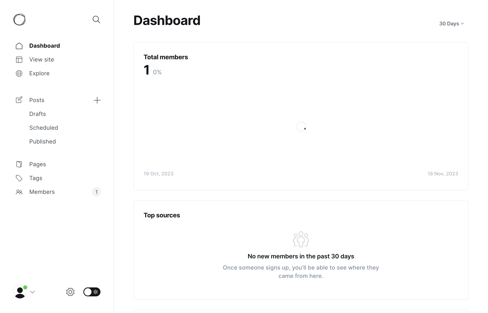
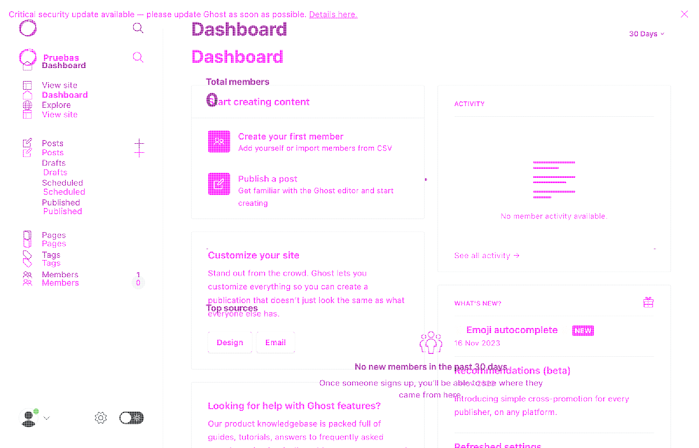

# ResembleJs

## Instrucciones de uso:

Acceder a la carpeta:

```bash
cd ResembleJs
```

Descargar las dependencias necesarias:

```bash
npm i
```

Ejecutar el reporte para todos los pasos del escenario 1

```bash
npm run step:1
```

## ¿Cómo funciona?

Los screenshots que se toman de los escenarios de Kraken, poseen un nombre, el cual tiene la versión de Ghost donde se corrió el escenario de prueba, el número del escenario y el número del step del escenario, luego, desde las configuraciones de index.js se emparejan estos screenshots de la versión 5.71.2 y la 4.48.0, estos se emparejan por número de escenario y paso ejecutado, un ejemplo para realizar una comparación de imágenes sería el siguiente:

**Imagen 1**

```bash
Ruta:

v4.48.0/kraken-node-scenarios/screenshots/kraken_Scenario2_4480_step_2.png
```


**Imagen 2**

```bash
Ruta:

v5.71.2/kraken-node-scenarios/screenshots/kraken_Scenario2_5712_step_1.png
```



**Comparación generada:**

```bash
Ruta:

ResembleJs/results/scenario-1-2023_11_18_220325/compare-Scenario1_step_2.png
```



Ahora teniendo en cuenta como se realiza el emparejamiento para la comparación, cuando se corre el comando de:

```bash
npm run test:1

```

Se realiza lo siguiente:

```bash
npm run start scenario=1 steps=5
```

En donde en los argumentos de **scenario** y **steps** determinan el escenario al cual se le generará un reporte y el número de pasos que tiene este escenario, por eso, los screenshots de un escenario tanto en la versión 4.48.0 como en la versión 5.71.2, deben tener el mismo número de pasos.
